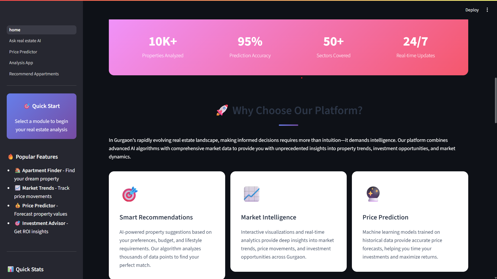

# 🏙️ Real Estate Analytics: AI-Powered Property Intelligence Platform

In Gurgaon's rapidly evolving real estate landscape, making informed decisions requires more than intuition—it demands intelligence.  
Our platform combines **advanced AI algorithms** with **comprehensive market data** to provide unprecedented insights into property trends, investment opportunities, and market dynamics.

---

## 📸 Interface Preview

### 🏠 Home Page


### 🧠 Ask Real Estate AI


### 💰 Price Prediction


---

## 📊 Platform Statistics

- **10K+** Properties Analyzed  
- **95%** Prediction Accuracy  
- **50+** Sectors Covered  
- **24/7** Real-time Updates  

---

## 🎯 Why Choose Our Platform?

Our AI-powered platform delivers:

1. **Smart Recommendations** – AI-driven property suggestions tailored to your preferences  
2. **Market Intelligence** – Real-time analytics and trend analysis  
3. **Price Prediction** – Advanced ML models for accurate property valuations  

---

## 🚀 Key Features

### 🎯 Smart Recommendations
AI-powered property suggestions based on your preferences, budget, and lifestyle requirements.  
Our algorithm analyzes thousands of data points to find your perfect match.

### 📊 Market Intelligence
Interactive visualizations and real-time analytics provide deep insights into market trends, price movements, and investment opportunities across Gurgaon.

### 💰 Price Prediction
Machine learning models trained on historical data provide accurate price forecasts, helping you time your investments and maximize returns.

---

## 🛠️ Core Functionalities

### 1. 🧠 Ask Real Estate AI
Upload any file and get expert real estate analysis powered by advanced AI.  
Supported file types include:
- 🖼️ Images (PNG, JPG, JPEG)
- 📄 PDF Documents
- 📝 Word Documents (DOCX)
- 📊 CSV Files
- 📜 Text Files
- 📈 Excel Files

Simply drag and drop your files, and our AI will provide detailed insights, market analysis, and investment recommendations.

---

### 2. 💰 Price Predictor
Make **data-driven property valuations** based on multiple parameters:
- Property Type (Flat, Independent House)
- Location (Sector-wise)
- Built-up Area (in sq.ft)
- Bedrooms, Bathrooms
- Property Age
- Luxury Category
- Floor Preferences
- Furnishing Status
- Amenities (Servant Room, Store Room, Balconies)

---

### 3. 📈 Analysis App
Comprehensive market analysis tools with interactive visualizations:
- Price trends by sector with dynamic charts  
- Voice & text-enabled AI analysis  
- Quick overview dashboards  
- Sector-wise comparisons  
- Real-time investment insights  

---

### 4. 🏘️ Apartment Recommendations
Smart apartment finder with advanced features:
- Location-based intelligent search  
- Customizable radius selection (1–50 km)  
- Multi-factor similarity matching  

Advanced Recommendation Features:
- Adjustable preference weights:
  - Facilities Similarity (0.00–1.50)
  - Pricing Similarity (0.00–1.50)
  - Location Similarity (0.00–1.50)
- Real-time property suggestions  
- Comprehensive comparisons  
- Similar apartment recommendations  

---

## 📊 Data Pipeline

Includes extensive data processing and analysis:
- Web scraping for real-time market data  
- Data cleaning and preprocessing  
- Feature engineering  
- Missing value & outlier treatment  
- Advanced analytics and modeling  

---

## 🤖 AI & Machine Learning Components

### 1. Recommendation Engine
- Cosine similarity-based matching  
- Multi-factor similarity scoring  
- Personalized recommendations  

### 2. Price Prediction Models
- Feature selection & engineering  
- Multiple model comparison  
- Baseline and advanced model implementation  

### 3. Market Analysis
- Univariate and multivariate analysis  
- Pandas profiling  
- Interactive visualizations  

---

## 📦 Project Structure

```
├── assets/                          # Project assets and images
├── data cleaning/                   # Data preprocessing notebooks
├── datasets/                        # Raw and processed datasets
├── Exploratory data analysis/       # EDA notebooks and reports
├── feature engineering/             # Feature creation and transformation
├── feature selection/               # Model feature selection
├── missing value and outlier treatment/  # Data quality improvement
├── model selection/                 # Model evaluation and selection
├── pages/                           # Streamlit application pages
├── recommender system/              # Recommendation engine
└── web scraping/                    # Data collection scripts
```

---

## 💡 How It Works

1. **Data Collection**
   - Web scraping from multiple sources  
   - Real-time data updates  
   - Market intelligence gathering  

2. **Data Processing**
   - Automated cleaning pipelines  
   - Feature extraction  
   - Quality assurance checks  

3. **AI Model Training**
   - Price prediction model development  
   - Recommendation system training  
   - Market analysis model creation  

4. **User Interface**
   - Interactive Streamlit dashboard  
   - Real-time analysis  
   - Customizable visualizations  

---

## 🔍 Insights Generation

Our AI system provides:
- Property valuation estimates  
- Investment opportunity detection  
- Market trend analysis  
- Personalized recommendations  
- ROI calculations  
- Location-based insights  

---

## 🚀 Getting Started

1. **Clone the repository**
   ```bash
   git clone https://github.com/<your-username>/Real-Estate-Analytics.git
   ```

2. **Install dependencies**
   ```bash
   pip install -r requirements.txt
   ```

3. **Run the app**
   ```bash
   streamlit run home.py
   ```

---

## 🧰 Technology Stack

- Python  
- Streamlit  
- Pandas  
- Scikit-learn  
- TensorFlow / Keras  
- Jupyter Notebooks  
- Machine Learning Algorithms  
- Web Scraping Tools  

---

## 🌟 Future Enhancements

- Real-time market predictions  
- Advanced AI chatbot integration  
- Enhanced visualization capabilities  
- Expanded geographical coverage  
- Mobile app version  

---

> Built with ❤️ and 🤖 by Parth Amilkanthwar for smarter real estate decisions.
